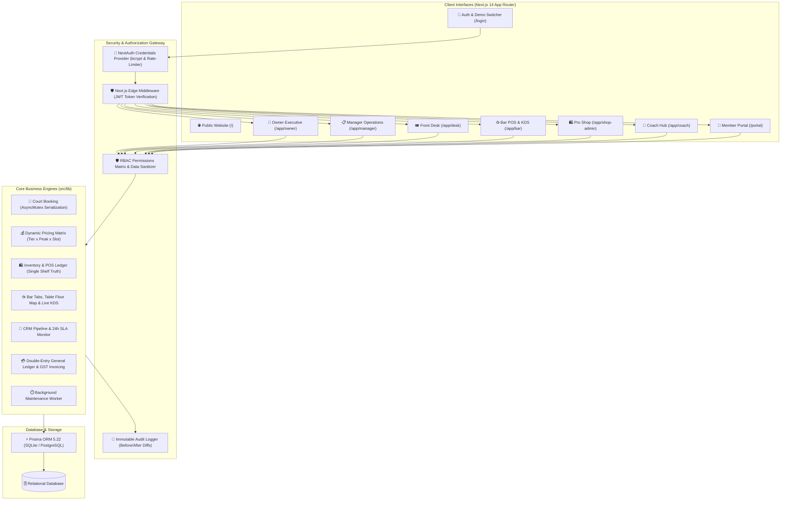

# 🏆 The Champions Club — Sports Club Management System

[](https://nextjs.org/)
[](https://www.typescriptlang.org/)
[](https://tailwindcss.com/)
[](https://next-auth.js.org/)
[](https://www.prisma.io/)
[](https://vitest.dev/)
[](https://opensource.org/licenses/MIT)

> **A unified, production-grade sports club management platform with server-enforced Role-Based Access Control (RBAC), dedicated role portals, high-throughput court scheduling, retail POS inventory, Kitchen Display System (KDS), member digital QR passes, and double-entry financial reconciliation.**

---

## 📑 Table of Contents
- [Executive Overview](#-executive-overview)
- [System Architecture & RBAC Flow](#-system-architecture--rbac-flow)
- [Dedicated Role Portals](#-dedicated-role-portals)
- [Hard Concurrency & Invariants](#-hard-concurrency--invariants)
- [Tech Stack & Architecture Decisions](#-tech-stack--architecture-decisions)
- [Role-Based Access Control Matrix](#-role-based-access-control-matrix)
- [Demo Credentials & Quick Login](#-demo-credentials--quick-login)
- [One-Command Quickstart](#-one-command-quickstart)
- [Automated Vitest Test Suite](#-automated-vitest-test-suite)
- [Project Directory Structure](#-project-directory-structure)

---

## 🎯 Executive Overview

**The Champions Club** is a busy sports and wellness destination in Bangalore featuring bookable courts (tennis, padel, badminton, cricket nets), a gear shop, a cafeteria/lounge, and front desk operations. This platform replaces fragmented WhatsApp bookings and Excel spreadsheets with **one unified database and application layer** providing dedicated, server-guarded portals for each distinct persona:

1. **Owner Command Center (`/app/owner`)**: Full executive governance, financial P&L, GST reports, staff payroll runs, user role management, and audit logs.
2. **Manager Operations (`/app/manager`)**: Daily facility execution, master court schedule, staff leave approvals, sales CRM pipeline, restock inventory.
3. **Front Desk Desk (`/app/desk`)**: Walk-in reservations, member onboarding, digital QR passes, member tab billing, CSV bulk migrations.
4. **Bar & F&B Operations (`/app/bar`)**: Touch POS terminal, Kitchen Display System (KDS), table floor maps, member tab charges, shift cash drawer.
5. **Pro Shop Retail (`/app/shop-admin`)**: Counter POS register, SKU inventory variants, racket stringing & repair service queue.
6. **Coach Command (`/app/coach`)**: Coaching schedule, private student player roster, skill development notes, court time allocations.
7. **Member Self-Service (`/portal`)**: Self-service court booking, digital QR membership card, personal tab balance, GST invoice history.
8. **Public Club Website (`/`)**: Real-time court availability, membership tier showcases, trial bookings, and corporate quote requests.

---

## 🏗️ System Architecture & RBAC Flow



---

## 🛡️ Role-Based Access Control Matrix

| Permission | `OWNER` | `MANAGER` | `FRONT_DESK` | `BAR_STAFF` | `SHOP_STAFF` | `COACH` | `MEMBER` |
|---|:---:|:---:|:---:|:---:|:---:|:---:|:---:|
| **Executive P&L & Tax Reports** (`finance:pnl`) | ✅ | ❌ | ❌ | ❌ | ❌ | ❌ | ❌ |
| **Financial Ledger Journal** (`finance:ledger`) | ✅ | ❌ | ❌ | ❌ | ❌ | ❌ | ❌ |
| **Staff Salary & Payroll Run** (`hr:payroll`) | ✅ | ❌ | ❌ | ❌ | ❌ | ❌ | ❌ |
| **User & Role Privileges** (`settings:users`) | ✅ | ❌ | ❌ | ❌ | ❌ | ❌ | ❌ |
| **Staff Leave Approvals** (`hr:leaves_approve`) | ✅ | ✅ | ❌ | ❌ | ❌ | ❌ | ❌ |
| **Court Reservations & Calendar** (`booking:create`) | ✅ | ✅ | ✅ | ❌ | ❌ | ❌ | ❌ |
| **Bar POS & Kitchen KDS** (`pos:bar`, `kds:update`) | ✅ | ✅ | ❌ | ✅ | ❌ | ❌ | ❌ |
| **Pro Shop Retail POS** (`pos:shop`) | ✅ | ✅ | ✅ | ❌ | ✅ | ❌ | ❌ |
| **Racket Stringing Queue** (`stringing:manage`) | ✅ | ✅ | ❌ | ❌ | ✅ | ❌ | ❌ |
| **Coaching Drills & Roster** (`coach:read_own`) | ✅ | ❌ | ❌ | ❌ | ❌ | ✅ | ❌ |
| **Member Self-Service & Tab** (`booking:create_own`) | ✅ | ❌ | ❌ | ❌ | ❌ | ❌ | ✅ |

For complete documentation on field-level sanitization and IDOR rules, see [`docs/RBAC.md`](docs/RBAC.md).

---

## 👥 Demo Credentials & Quick Login

All accounts are pre-seeded with password: **`Demo@1234`**

| Role | Name | Email | Password | Dedicated Portal |
|---|---|---|---|---|
| **👑 OWNER** | Vikram Malhotra | `owner@championsclub.in` | `Demo@1234` | `/app/owner` |
| **📋 MANAGER** | Ananya Sharma | `manager@championsclub.in` | `Demo@1234` | `/app/manager` |
| **🎟️ FRONT_DESK** | Rahul Verma | `frontdesk@championsclub.in` | `Demo@1234` | `/app/desk` |
| **☕ BAR_STAFF** | Sanjay Kumar | `bar@championsclub.in` | `Demo@1234` | `/app/bar` |
| **🛍️ SHOP_STAFF** | Pooja Patel | `shop@championsclub.in` | `Demo@1234` | `/app/shop-admin` |
| **🎾 COACH** | Rohan Bopanna | `coach@championsclub.in` | `Demo@1234` | `/app/coach` |
| **🥇 MEMBER (Gold)** | Arjun Reddy | `arjun.gold@gmail.com` | `Demo@1234` | `/portal` |
| **🥈 MEMBER (Silver)** | Priya Nair | `priya.silver@gmail.com` | `Demo@1234` | `/portal` |
| **🧒 MEMBER (Junior)** | Rohan Kapoor | `rohan.junior@gmail.com` | `Demo@1234` | `/portal` |

---

## ⚡ One-Command Quickstart

### Prerequisites
- Node.js 18.17+ or 20+
- npm or pnpm

### 1. Install Dependencies & Setup Database
```bash
# One-command full setup (generates Prisma client, pushes schema, and seeds demo data)
npm run setup
```

### 2. Launch Development Server
```bash
npm run dev
```
Open **`http://localhost:3000`** in your browser. Visit **`/login`** to authenticate directly as any staff role or member.

---

## 🧪 Automated Vitest Test Suite

The platform includes **23 automated tests** covering hard concurrency, double-booking prevention, dynamic pricing, inventory stock integrity, and server RBAC boundaries:

```bash
npm run test
```

### Test Results Breakdown:
- **`test/concurrency.test.ts`**: Simulates **10 simultaneous booking attempts** at the EXACT same court and time slot using `Promise.all`. Verifies that exactly **1 request succeeds** and **9 requests fail with conflict errors**.
- **`test/business-rules.test.ts`**: Verifies dynamic pricing rules, peak hour multipliers, member tier discounts (Gold free courts, Silver reduced rate, Junior under-18 restrictions), daily booking limits, inventory auto-decrements, and double-entry ledger transactions.
- **`test/rbac.test.ts`**: Verifies role matrix bounds, permission checks (`can()`), route guards, field-level cost/salary data redaction (`sanitizeForRole()`), and bcrypt hash validation.

---

## 📁 Project Directory Structure

```
the-champions-club/
├── docs/
│   └── RBAC.md                 # Full RBAC & Route Boundary Specification
├── prisma/
│   ├── schema.prisma           # 44 portable database models & relations
│   └── seed.ts                 # Full club seed (courts, sports, members, staff)
├── src/
│   ├── app/
│   │   ├── (public)/           # Landing page & public trial booker
│   │   ├── 403/                # Access Forbidden error page
│   │   ├── login/              # Credentials + OTP + Quick Demo login
│   │   ├── portal/             # Member Self-Service portal & digital pass
│   │   ├── app/
│   │   │   ├── owner/          # 👑 Owner Executive Governance & P&L
│   │   │   ├── manager/        # 📋 Manager Operations & Schedule
│   │   │   ├── desk/           # 🎟️ Front Desk Check-in & Onboarding
│   │   │   ├── bar/            # ☕ Bar POS, Tables & KDS Kitchen
│   │   │   ├── shop-admin/     # 🛍️ Pro Shop Counter POS & Stringing
│   │   │   └── coach/          # 🎾 Coach Dashboard & Student Roster
│   │   └── api/                # Protected Next.js REST API routes
│   ├── components/
│   │   ├── navbar.tsx          # Real session badge & logout button
│   │   ├── portal-sidebar.tsx  # Role-tailored dynamic navigation sidebar
│   │   └── role-guard.tsx      # Server-verified client role guard
│   ├── lib/
│   │   ├── auth.ts             # NextAuth config & credentials authorize
│   │   ├── roles.ts            # Typed role consts, Zod schema & role metadata
│   │   ├── permissions.ts      # RBAC permissions matrix & data sanitizer
│   │   ├── concurrency.ts      # Atomic court booking Mutex lock engine
│   │   ├── pricing.ts          # Tier x Peak x Sport rate calculations
│   │   ├── inventory.ts        # Atomic POS stock sale & reorder engine
│   │   ├── tabs.ts             # Bar tab charge & split-bill settlement
│   │   ├── cron.ts             # Background membership expiry & auto-release
│   │   └── audit.ts            # Immutable DB audit logging
│   └── types/
│       └── next-auth.d.ts      # NextAuth JWT session type extensions
└── test/
    ├── concurrency.test.ts     # 10-way race condition collision test
    ├── business-rules.test.ts  # 10 business logic invariant tests
    └── rbac.test.ts            # 12 RBAC & data redaction tests
```

---

## 📜 License

This project is licensed under the MIT License — feel free to use and extend for club management deployments!
