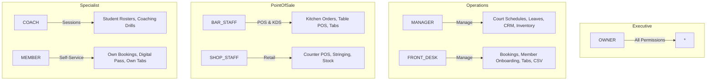

# Role-Based Access Control (RBAC) & Portal Architecture Specification

## 1. Executive Summary

"The Champions Club" platform enforces a strict, server-verified Role-Based Access Control (RBAC) architecture. All authentication is powered by NextAuth with bcrypt-hashed credentials, signed HTTP-only JWT sessions, and server middleware boundaries. Client-side persona state and role modification vulnerabilities have been replaced with dedicated, isolated role portals.

---

## 2. Roles & Portal Routing Matrix

| Role | Role Title | Portal Path | Accent Theme | Key Responsibilities |
|---|---|---|---|---|
| **`OWNER`** | Club Owner & Executive | `/app/owner` | Violet (`purple`) | Full governance, Executive P&L, GST reconciliation, Staff Payroll runs, Plan/Court pricing config, User & Role administration, Immutable Audit Logs. |
| **`MANAGER`** | Operations Manager | `/app/manager` | Blue (`blue`) | Daily facility execution, master court schedule, staff leave approvals, sales CRM pipeline, restock inventory alerts, member directory. |
| **`FRONT_DESK`** | Front Desk Officer | `/app/desk` | Emerald (`emerald`) | Walk-in reservations, member onboarding, digital QR passes, member tab billing & settlements, bulk CSV member migrations. |
| **`BAR_STAFF`** | Bar & F&B Staff | `/app/bar` | Rose (`rose`) | Touch POS terminal, Kitchen Display System (KDS), table floor maps, member tab charges, shift cash drawer balance. |
| **`SHOP_STAFF`** | Pro Shop Staff | `/app/shop-admin` | Amber (`amber`) | Retail counter POS register, inventory variant stock, racket stringing & repair service queue, equipment rentals. |
| **`COACH`** | Certified Head Coach | `/app/coach` | Cyan (`cyan`) | Coaching schedule, private student player roster, skill development notes, court time allocations. |
| **`MEMBER`** | Club Member (Gold / Silver / Junior) | `/portal` | Teal (`teal`) | Self-service court booking, digital QR membership card, personal tab balance, GST invoice history. |

---

## 3. Granular Permissions Matrix



### Detailed Permission Mapping

| Permission | `OWNER` | `MANAGER` | `FRONT_DESK` | `BAR_STAFF` | `SHOP_STAFF` | `COACH` | `MEMBER` |
|---|:---:|:---:|:---:|:---:|:---:|:---:|:---:|
| `finance:pnl` | ✅ | ❌ | ❌ | ❌ | ❌ | ❌ | ❌ |
| `finance:ledger` | ✅ | ❌ | ❌ | ❌ | ❌ | ❌ | ❌ |
| `hr:payroll` | ✅ | ❌ | ❌ | ❌ | ❌ | ❌ | ❌ |
| `settings:users` | ✅ | ❌ | ❌ | ❌ | ❌ | ❌ | ❌ |
| `settings:plans` | ✅ | ❌ | ❌ | ❌ | ❌ | ❌ | ❌ |
| `hr:leaves_approve`| ✅ | ✅ | ❌ | ❌ | ❌ | ❌ | ❌ |
| `booking:create` | ✅ | ✅ | ✅ | ❌ | ❌ | ❌ | ❌ |
| `booking:create_own`| ✅ | ✅ | ✅ | ❌ | ❌ | ❌ | ✅ |
| `member:read_all`| ✅ | ✅ | ✅ | ❌ | ❌ | ❌ | ❌ |
| `member:read_own`| ✅ | ✅ | ✅ | ✅ | ✅ | ✅ | ✅ |
| `pos:bar` | ✅ | ✅ | ❌ | ✅ | ❌ | ❌ | ❌ |
| `kds:update` | ✅ | ✅ | ❌ | ✅ | ❌ | ❌ | ❌ |
| `pos:shop` | ✅ | ✅ | ✅ | ❌ | ✅ | ❌ | ❌ |
| `stringing:manage`| ✅ | ✅ | ❌ | ❌ | ✅ | ❌ | ❌ |
| `coach:read_own` | ✅ | ❌ | ❌ | ❌ | ❌ | ✅ | ❌ |

---

## 4. Field-Level Data Filtering & Sanitization

To prevent data exfiltration across endpoints, sensitive fields are stripped on the server based on the caller's verified session role (`src/lib/permissions.ts` -> `sanitizeForRole`):

1. **`costPricePaise` (Product Variants)**: Stripped from all responses unless the user is `OWNER` or `MANAGER`.
2. **`monthlySalaryPaise` (Staff Employees)**: Redacted from all employee directory views unless requested by `OWNER`.
3. **`ledgerTransactions` (Financial Transactions)**: Completely blocked to non-`OWNER` roles with HTTP 403.
4. **Member 360 IDOR Protection**: Members requesting `/api/members/:id` can only retrieve their own record (matched against `session.user.id`).

---

## 5. NextAuth & JWT Session Architecture

- **Session Strategy**: Signed JSON Web Token (JWT).
- **Cookie Settings**: `httpOnly: true`, `sameSite: "lax"`, `secure: process.env.NODE_ENV === "production"`.
- **Payload**:
  ```json
  {
    "id": "user-owner-1",
    "name": "Vikram Malhotra",
    "email": "owner@championsclub.in",
    "role": "OWNER",
    "memberId": null,
    "memberCode": null
  }
  ```
- **Rate Limiter**: In-memory rate limiting rejects brute force attempts exceeding 5 failures per 60 seconds per email.
- **Deactivation Check**: Inactive or suspended accounts (`isActive: false`) are rejected at the authentication gateway.

---

## 6. Demo Accounts & Evaluator Credentials

All accounts are seeded with password: **`Demo@1234`**

| Role | Name | Email | Password | Home Portal |
|---|---|---|---|---|
| **OWNER** | Vikram Malhotra | `owner@championsclub.in` | `Demo@1234` | `/app/owner` |
| **MANAGER** | Ananya Sharma | `manager@championsclub.in` | `Demo@1234` | `/app/manager` |
| **FRONT_DESK** | Rahul Verma | `frontdesk@championsclub.in` | `Demo@1234` | `/app/desk` |
| **BAR_STAFF** | Sanjay Kumar | `bar@championsclub.in` | `Demo@1234` | `/app/bar` |
| **SHOP_STAFF** | Pooja Patel | `shop@championsclub.in` | `Demo@1234` | `/app/shop-admin` |
| **COACH** | Rohan Bopanna | `coach@championsclub.in` | `Demo@1234` | `/app/coach` |
| **MEMBER (Gold)** | Arjun Reddy | `arjun.gold@gmail.com` | `Demo@1234` | `/portal` |
| **MEMBER (Silver)**| Priya Nair | `priya.silver@gmail.com` | `Demo@1234` | `/portal` |
| **MEMBER (Junior)**| Rohan Kapoor | `rohan.junior@gmail.com` | `Demo@1234` | `/portal` |
